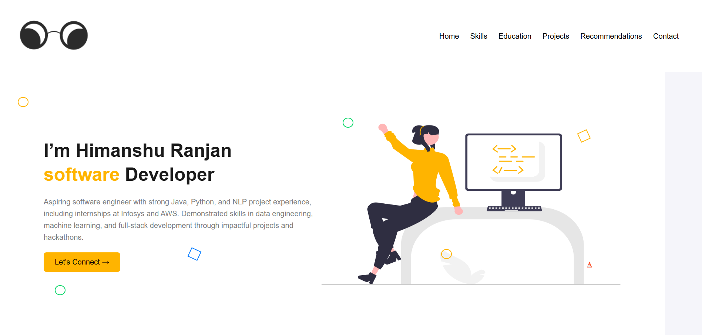

# 💼 Personal Portfolio – Himanshu Ranjan

This is my personal developer portfolio website built using **HTML, CSS, and JavaScript**. It showcases my skills, projects, education, and contact information in a visually appealing and responsive layout.

## 🌟 Features

- Fully responsive design for desktop and mobile
- Sections for:
  - About Me
  - Skills & Languages
  - Projects (Java, Python, and Machine Learning)
  - Recommendations
  - Contact Information
- Modal-based skill adder
- Interactive recommendation slider
- Clean and modern UI/UX

## 🚀 Technologies Used

- HTML5
- CSS3
- JavaScript (Vanilla)
- Custom assets and icons

## 🧠 Highlights

This portfolio highlights several academic and internship-based projects using:
- **Java & Spring Boot** (e.g., Hotel Management System)
- **Python & Machine Learning** (e.g., Heart Disease Prediction, NLP-based Meeting Summarizer)
- AI/NLP technologies (e.g., GPT-4 Turbo integration)

## 📸 Preview

  


## 🔗 Live Demo

[🔗 View Live Portfolio](https://github.com/him77anshu/Personal-Portfolio)  


## 📁 How to Use

1. Clone the repository:

   ```bash
   git clone https://github.com/him77anshu/Personal-Portfolio.git
